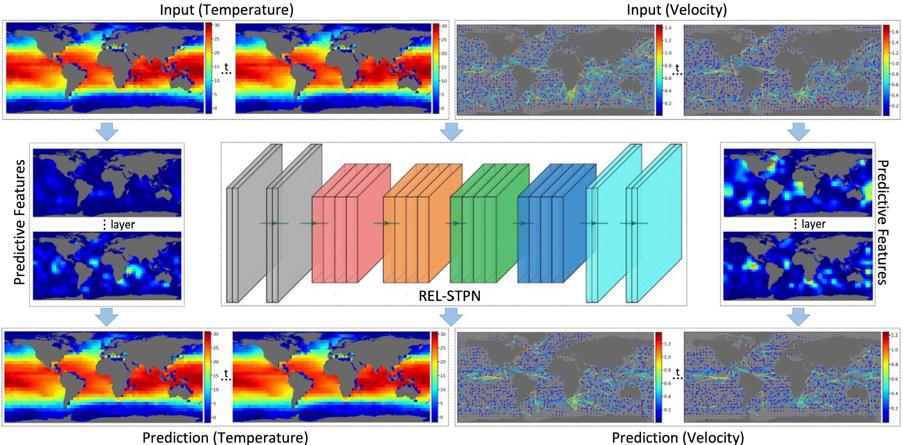
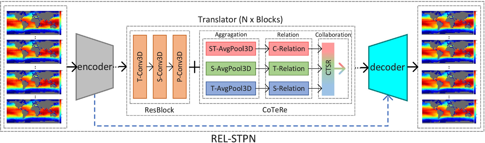

# OceanVP: A HYCOM based Benchmark Dataset and A Relational Spatiotemporal Predictive Network for Oceanic Variable Prediction

This repo releases the data and code for the paper:

- OceanVP: A HYCOM based Benchmark Dataset and A Relational Spatiotemporal Predictive Network for Oceanic Variable Prediction. (Ocean Engineering, 2024, DOI: [10.1016/j.oceaneng.2024.117748](https://doi.org/10.1016/j.oceaneng.2024.117748))

## Overview

OceanVP is a common benchmark dataset for studying the deep-learning-based methods for oceanic variable prediction tasks. The data source is derived from water temperature, velocity, and salinity elements in the HYCOM (Hybrid Coordinate Ocean Model) reanalysis data product from 1994 to 2015.

<div align="center">
   
</div>

The REL-STPN framework provides the benchmark method for the OceanVP dataset. It introduces and improves a collaborative ternary relation ([CoTeRe](http://www.ecva.net/papers/eccv_2020/papers_ECCV/papers/123510375.pdf), ECCV 2020,  [see more details](#citation)) method, aiming to learn and reason the internal relations from the oceanic variable data. On the OceanVP dataset, the benchmark method has achieved SOTA performance and fast model iterations on a single NVIDIA RTX 3090 GPU with a training duration of less than 4h and an inference speed of over 1000 FPS.

<div align="center">
   
</div>

The contents of this repo are organized as:
* [**Updates**](#updates)
* [**Dataset Download**](#dataset-download)
* [**Preparation**](#preparation)
* [**Getting Started**](#getting-started)
* [**Model Zoo**](#model-zoo)
* [**Visualization**](#visualization)
* [**License**](#license)
* [**Acknowledgement**](#acknowledgement)
* [**Citation**](#citation)

## Updates

- [2024-06-20] The data and code for OceanVP are released.

## Dataset Download
The OceanVP dataset can be downloaded via the [Google Drive](https://drive.google.com/file/d/1AEnlUD0KRHbwEmKDlezWpwoQvEyX00jY/view?usp=drive_link) or [Baidu Netdisk](https://pan.baidu.com/s/1fu02GIgmConqov_VXEP97w?pwd=ovp1) links.

## Preparation
Please refer to the instructions in [PREPARATION.md](docs/PREPARATION.md) for installation and data preparation.

## Getting Started
Please refer to [GETTING_STARTED.md](docs/GETTING_STARTED.md) for running the benchmark method.

## Model Zoo
The models and results are provided in [MODEL_ZOO.md](docs/MODEL_ZOO.md).

## Visualization
The visualization results are provided in [VISUALIZATION.md](docs/VISUALIZATION.md).

## License
The data and code in this repo are released under the [Apache 2.0 license](LICENSE).

## Acknowledgement
Thanks for the works and their contributors of the following codebases and data products.

- [zhenglab/cotere-net](https://github.com/zhenglab/cotere-net)
- [chengtan9907/OpenSTL](https://github.com/chengtan9907/OpenSTL)
- [HYCOM GOFS 3.1 Reanalysis Data](https://www.hycom.org/dataserver/gofs-3pt1/reanalysis)

## Citation

```
@article{shi2024oceanvp,
  title={OceanVP: A HYCOM based benchmark dataset and a relational spatiotemporal predictive network for oceanic variable prediction},
  author={Shi, Zhensheng and Zheng, Haiyong and Dong, Junyu},
  journal={Ocean Engineering},
  volume={304},
  pages={117748},
  year={2024},
  publisher={Elsevier}
}

@inproceedings{shi2020cotere,
  title={CoTeRe-Net: Discovering collaborative ternary relations in videos},
  author={Shi, Zhensheng and Guan, Cheng and Cao, Liangjie and Li, Qianqian and Liang, Ju and Gu, Zhaorui and Zheng, Haiyong and Zheng, Bing},
  booktitle={European Conference on Computer Vision},
  pages={379--396},
  year={2020},
  organization={Springer}
}

```
